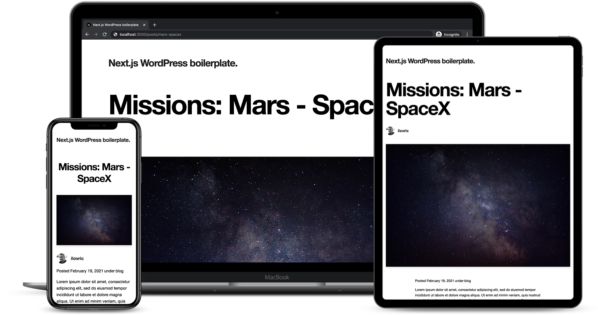

Inspired by [Next.js's example](https://github.com/vercel/next.js/tree/canary/examples/cms-wordpress) for statically generated blog using [WordPress](https://wordpress.org/) as the data source.

# Next.js WordPress Boilerplate (starter kit)

A statically generated blog example using [Next.js](https://nextjs.org/) and [WordPress](https://wordpress.org/) as headless CMS.

## Demo

### [https://cms.workspace.hr](https://cms.workspace.hr/)



---

## How to use

### Prerequisites

First, make sure you have `Node.js` (**npm** or **yarn**) installed.

```
$ node -v
v16.x.x
```

Also, you can use `nvm` as a helpful tool to install the correct **node** and **npm**/**yarn** version.

### Installing the application

```
$ git clone https://github.com/workspace-agency/nextjs-wordpress-boilerplate.git <my-project-name>
$ cd <my-project-name>
$ yarn
```

_This command will install all of the latest dependencies. Installation might take some time._

### Set up environment variables

Copy the `.env.local.example` file in this directory to `.env.local` (_which will be ignored by Git_):

```bash
cp .env.local.example .env.local
```

Then open `.env.local` and set `WORDPRESS_API_URL`, `WORDPRESS_AUTH_REFRESH_TOKEN`, and `WORDPRESS_PREVIEW_SECRET` to match your WordPress data.
You can find the full configuration guide here:

> [WordPress Configuration Guide](https://github.com/workspace-agency/nextjs-wordpress-boilerplate/blob/main/wp-configuration-guide.md)

Your `.env.local` file should look like this:

```bash
WORDPRESS_API_URL=...

# Only required if you want to enable preview mode
WORDPRESS_AUTH_REFRESH_TOKEN=
WORDPRESS_PREVIEW_SECRET=
```

### Running the application

```
$ yarn dev
```

_Runs the app in the development mode. Open [http://localhost:3000](http://localhost:3000) to view it in the browser._

### Building the application

```
$ yarn build
```

_Builds the application for production usage._

---

## Built with

- [Next.js](https://github.com/vercel/next.js) as a [React](https://github.com/facebook/react/) framework for Static Generation and Server-side Rendering
- [TypeScript](https://github.com/microsoft/TypeScript) as a language for application-scale JavaScript
- [Sass](https://github.com/sass/dart-sass) as CSS pre-processor
- [Material-UI](https://github.com/mui-org/material-ui) as component library

## Libraries

In addition several smaller libraries are used. Instructions on how to use them are linked below.

| Library                                               | Purpose                                                 |
| ----------------------------------------------------- | ------------------------------------------------------- |
| [date-fns](https://github.com/date-fns/date-fns)      | for manipulating JavaScript dates                       |
| [Classnames](https://github.com/JedWatson/classnames) | for conditionally joining classNames together           |
| [ESLint](https://github.com/eslint/eslint)            | for making code more consistent and avoiding bugs       |
| [Stylelint](https://github.com/stylelint/stylelint)   | for avoiding errors and enforcing conventions in styles |
| [Prettier](https://github.com/prettier/prettier)      | for code formatting                                     |
| [Husky](https://github.com/typicode/husky)            | for preventing bad commit or push                       |

See `package.json` for a complete overview.

---

## Folder structure

```
.
├── components                                 # place for all reusable components
│   └── {ComponentName}                        # reusable component
│   │   ├── {ComponentName}.module.scss        # component styles
│   │   ├── {ComponentName}.tsx                # component
│   │   └── index.ts                           # for root component of a directory
├── lib                                        # place to store services, config, etc.
│   ├── api.ts                                 # API functions
│   ├── constants.ts                           # place to store all app constants
│   └── queries.ts                             # place to store all GraphQL queries
├── pages                                      # place to store pages (routes); each page should match a route
│   ├── api                                    # API routes
│   ├── {page}                                 # place for page (route)
│   │   ├── [param].tsx                        # dynamic page (route)
│   │   └── index.tsx                          # page (route)
│   ├── _app.tsx                               # custom App
│   ├── _document.tsx                          # custom Document
│   └── index.tsx                              # home page
├── public                                     # place to store static files, like images
├── styles                                     # place to store global styles
│   ├── globals                                # place for reset and base styling
│   ├── mixins                                 # place to store all mixins
│   ├── settings                               # place to store all fonts, colors, and breakpoints
│   ├── utils                                  # place to store all utility functions for styling
│   └── index.scss                             # styling entry point
├── types                                      # place to store all types
└── utils                                      # place to store all utility functions that are shared across the app
    ├── context                                # place to store all Context data
    └── hooks                                  # place to store all custom Hooks

```

## Style Guide

As a "base" style guide, the [Airbnb's style guide](https://airbnb.io/javascript/react) is being used. Since we're applying different eslint configs that are combined with Airbnb's [config](https://yarnpkg.com/package/eslint-config-airbnb), large number of these rules are already enforced.

## Versioning

This project use [SemVer](http://semver.org/) for versioning. For the versions available, see the [tags on this repository](https://github.com/workspace-agency/nextjs-wordpress-boilerplate/tags).

## Contributing

If you're interested in contributing to this project, please first discuss the change you wish to make via issue, email, or any other method with the owner of this repository before submitting a pull request.
